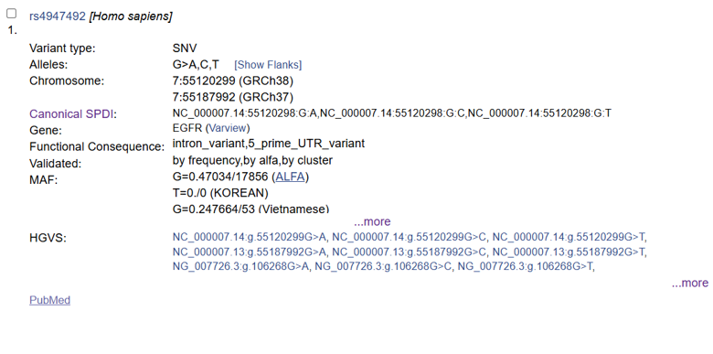

# Project Design & Integration Workbook

## EGFR Mutations in Non-Small Cell Lung Cancer:
### A Multi-Database Analysis of Actionable Variants

Day 5 - Bioinformatics Internship 2026

# Why EGFR? Real Disease. Real Impact. Real Bioinformatics.

## The Problem:

- Non-small cell lung cancer (NSCLC) kills 1.4 million annually worldwide
- EGFR mutations drive ~20-35% of NSCLC cases (higher in non-smokers, Asian populations)
- Mutations like L858R and exon 19 deletions are ACTIONABLE: drugs like gefitinib cause tumor shrinkage
- Your challenge: Analyze EGFR mutations. Predict which ones are oncogenic. Understand why drugs work.

# Exercise 1: Define Your Research Question

**My research question:**

Why do EGFR-mutant tumors develop resistance to gefitinib? Which secondary mutations emerge and why?

# Exercise 2: Literature Review - Why Does This Matter?

1. Search PubMed for: 'EGFR mutation lung cancer' + your specific interest
2. Find at least 2 relevant papers. Document the DOI/PMID.
3. Summarize: What do we already know? What gap are you filling?

EGFR - epidermal growth factor receptor

**Paper 1 PMID/DOI:** [10.1016/j.gene.2012.12.087](https://www.esmoopen.com/article/S2059-7029(20)32568-0/fulltext)

**Name:** Mechanisms of resistance to EGFR-targeted drugs: lung cancer

**Key finding:** This paper outlines two distinct pathways through which Non small cell lung cancer (NSCLC) tumors stop responding to gefitinib and related Tyrosine kinase inhibitors(TKIs): intrinsic resistance, in which the drug fails to produce meaningful benefit from the outset, and acquired resistance, in which an initial response is later lost, typically within 9 to 14 months. The several resistance mechanisms identified were the occurrence of secondary mutation, the activation of alternative signalling, the aberrance of the downstream pathways, the impairment of the EGFR-TKIs-mediated apoptosis pathway and histological transformation. Acquired resistance to first-generation EGFR-TKIs (to which geifitinib belongs to) has the occurrence of secondary EGFR kinase domain mutation in exon 20, the T790M substitution, as the major mechanism in half the cases.

Study of intrinsic resistance-causing mutations, though not fully understood, have 2 categories: the non classical sensitising mutations and the classical EGFR mutations which are deletion in exon 19 and L858R. The most common mutations of the EGFR gene are point mutations in exons 18,20 and 21 and indels in exon 19. Eight randomized controlled phase III trials have established that first- and second-generation EGFR-TKIs(eg: gefitinib) represent the preferred first-line treatment for patients with advanced NSCLC whose tumors harbor EGFR mutations, outperforming standard chemotherapy through significant improvements in both response rate and progression-free survival.

**Paper 2 PMID/DOI:** [https://doi.org/10.1155/2020/1973241Digital Object Identifier (DOI)](https://doi.org/10.1155/2020/1973241)

**Name:** EGFRPolymorphism and Survival of NSCLC Patients Treated with TKIs: A Systematic Review and Meta-Analysis

**Key finding:** EGFR is a transmembrane receptor which has a tyrosine kinase domain. Due to mutations, over-activation leads to cancer as tyrosine kinase is a critical enzyme for cell proliferation and metastasis. Gefitinib was the first TKI drug used for treatment but the major issue with the prognosis of this EGFR mutation lung cancer was the resistance developed for the drug. This resistance is intrinsic if it’s due to variations caused by EGFR SNPs and acquired if secondary EGFR mutations occur during treatment.

According to this review article, out of ten investigated EGFR SNPs (rs11543848, rs11568315, rs11977388, rs2075102, rs2227983, rs2293347, rs4947492, rs712829, rs712830, and rs7809028), only four, namely, rs712829 (-216G>T), rs11568315 (CA repeat), rs2293347 (D994D) and rs4947492, have been reported to affect the outcome of TKI-based NSCLC treatment.

---

**Knowledge gap you're addressing:** From the second study (2020), since EGFR is a mutation prone gene which is highly polymorphic, treatment using existing TKI drugs like gefitinib does not assure a complete cure. Published research studies give inconsistent results and available meta-analyses lack the comprehensiveness in terms of included SNPs. Additional studies have to be made to realise if the identified SNPs of the EGFR gene prevents the patient from responding to other TKI treatments or if other EGFR SNPs affect the treatment of NSCLC.

# Exercise 3: Design Your Workflow

Map out which Days 1-4 tools you'll use and in what order:

| Step | Tool/Database | Expected Output |
|---|---|---|
| 1) | dbSNP | Basic identity of the SNP — its position, reference/alternate alleles, gene locus, and population frequency data |
| 2 | UCSC | Visualizes the SNP's exact location within the gene structure (exon vs. intron), helping determine its likely functional category |
| 3 | GTEx | Shows whether the SNP is associated with changes in gene expression levels across different tissues (eQTL data) |
| 4 | GEO | Provides gene expression datasets to test expression differences that relate to gefitinib sensitive and resistance tumor cells |

# Exercise 4: Project Proposal - Write Now, Execute Later

Write a 600-800 word project proposal including:

- Title (specific, not generic)
- Research Question (what are you answering?)
- Background (why does EGFR matter? What's known? What's the gap?)
- Hypothesis (if applicable, what do you expect to find?)
- Methods (which databases, in what order, why)
- Expected Output (what will you deliver? Figures, tables, findings)
- Timeline (which days for which steps)

## PROPOSAL:

**Title:**

The molecular mechanism behind the resistance caused by the SNP rs4947492 to the Tyrosine kinase inhibitor(TKI) drug gefitinib for Non-small cell lung cancer.

**Research question:**

Using in silico analysis of gene location, regulatory features, and structural positioning, does the EGFR SNP rs4947492 show plausible evidence of directly or indirectly(by linkage disequilibrium) contributing to intrinsic resistance to gefitinib in NSCLC patients, or is its reported association with treatment due to other factors such statistical artifact?

**Background:**

Existing research(Jurisic et al., 2020) has focused on idenitfying the SNPs which are intrinsically responsible for causing resistance to the TKI drug gefitinib which is used as a treatment for Non small cell lung cancer(NSCLC).

NSCLC is the leading cause of cancer death and out of the 2 types of lung cancer-small cell and non small cell, the latter is more predominant(85% of cases) (Jurisic et al., 2020). A major contributor is gene variations, especially in the Epidermal Growth Factor Receptor(EGFR) gene.

EGFR is a transmembrane tyrosine kinase receptor and on activation and overexpression, it leads to cell proliferation, ultimately causing cancer due to a series of events that follow. Certain drugs like Gefitinib have been approved for the treatment of NSCLC by targetting and inhibiting the tyrosine kinase domain of EGFR, hence acting as Tyrosine Kinase Inhibitors (TKI). The action of this first-class drug is to bind reversibly to the TK domain to prevent attachment of ATP. The mutation targetted by it is Exon 19 deletion and Exon 21 L858R.

However, tumor cells develop resistance to these drugs, primarily due to secondary mutations that develop from the treatment. But there also exist inherited variations in the form of SNPs or single nucleotide polymorphisms. EGFR’s gene, being a mutation and variation prone gene, has 1200 SNPs and 2700 mutations identified. (Jurisic et al., 2020).

Of the ten EGFR SNPs identified through a systematic literature search (rs11543848, rs11568315, rs11977388, rs2075102, rs2227983, rs2293347, rs4947492, rs712829, rs712830, and rs7809028), only four — rs712829, rs11568315, rs2293347, and rs4947492 — were reported by a study(Jurisic et al., 2020) to significantly affect survival outcomes (overall survival, progression-free survival, or time to progression) in TKI-treated NSCLC patients. The remaining six did not show a significant association in the studies conducted.

Moreover, by a pooled analysis (meta-data of hazard ratio of all 4 SNPs from various research articles, and generating forest plots)out of the 4 SNPs, 2 remained stastistically insignificant due to lack of research done on them - rs2293347 and rs4947492.

However, the SNP rs2293347 is a synonymous variant and doesn’t show a change in the protein structure inspite of the presence of the variant.

Hence, the SNP rs4947492 is chosen due to the absence of prior annotations and unknown information at all levels, the DNA sequence, RNA and protein sequence.

**Hypothesis:**

By analysing the SNP rs4947492 using the given tools, we can find out if the SNP contributes directly, indirectly or not at all to Gefitinib resistance.

**Contributes directly** - if annotation shows rs4947492 sits very close to a splice site, or if its chromosomal location suggests it could disrupt a regulatory element controlling EGFR expression.

**Contributes indirectly** – if it is jointly inherited with a neighbouring SNP(linkage disequilibrium) which may act as the real cause of the resistance.

**Doesn’t contribute to resistance** – when no clear regulatory, splicing or structural plausibility exists which indicates that the SNP contributes to resistance to gefitinib. This could mean that the SNP identified is a statistical artifact, that is, by small sizes, multiple testing or lifestyles of the patients tested (population specific confounding), results were not biologically related to the SNP causing an actual effect on the treatment to Gefitinib.

**Method and workflow:**

**Tools used:** dbSNP, UCSC, GTEx, GEO

1. dbSNP — type rs4947492 to get its exact position, allele change, and consequence type (intronic, near a splice site, etc.).
2. UCSC — using the position get the EGFR gene structure and the raw DNA sequence around the SNP, to know exactly where it sits relative to exons/introns.
3. GTEx - mechanistic link between the SNP, altered EGFR expression, and TKI response or survival in NSCLC patients
4. GEO – checking EGFR expression in gefitinib sensitive and resistance tumour cells

**Expected output –**

**Using dbSNP:**

  

**Findings –**

**Chomosomal location –**

Located in chromosome 7, at position 55120299 (according to GR38).

**Presence of bp in the allele -**

The bp G can change to A/C/T based on the individual and the SNV still takes effect.

**Functional consequence –**

The SNP/variant can be found either within an intron or in the 5’ prime UTR. This has significance as it shows that the SNP can be a reason for affecting the regulatory sequence in the UTR region/ribosome binding, hence proving that this variant can cause a change in mRNA stability or translation.

**MAF(minor allele frequency):**

It goes to prove the research gap of having inconsistent findings as different individuals in different populations show different allele frequencies.

**Using UCSC:**

By searching chromosomal location obtained from dbSNP (with organism as Homo sapiens and GR38)

By searching the SNP id: rs4947492,

**Findings –**

It is a common mutation which is mainly biallelic in nature due to similar percentages in the presence of G and A bases as variants.

It can be said that the SNP is an intronic variant and is not found in the 5’ UTR region as suggested by dbSNP since all isoforms of transcripts show it as an intronic variant.

Since it is present only in the intron and not even the intron-exon boundary which is a possibiliy of influencing the splice site, it implies that the presence of this SNP does not affect the amino acids sequence or the final protein.

So it can be said that it does not have a direct contribution in gefitinib resistance.

**Using GTEx portal:**

**Findings-**

The association of the SNP in adipose-subcutaneous tissue is very significant

Every NES value is negative, meaning the A allele consistently correlates with reduced EGFR expression, and the G allele with relatively higher expression. This consistency across independent tissues strengthens confidence that this is a real regulatory effect,.

NES values (-0.10 to -0.16) indicate a mild shift in expression, consistent with what's typical for an intronic regulatory variant rather than a large-effect coding mutation.

**Using GEO:**

On searching “gefitinib resistance sensitive”:

GEO series number : GSE156054

According to image 2,

HCC827 vs HCC827-GR — parental vs. Gefitinib-Resistant subline

PC9 vs PC9-GR — parental vs. Gefitinib-Resistant subline

H1975 vs H1975-OR — parental vs. Osimertinib-Resistant subline

(highlighted ones are grouped for sensitive (green) and resistance(purple) for gefitinib)

Using GEO2R,

Top 250 differentially expressed genes were found. Out of which, these gene EGFR had the following values :

Due to small sample size of only 2 for sensitive and resistance each, statistically insignificant results were obtained for adj.p.val. But the logfc value shows a high fold change from grp2 to grp 1 (ie. From resistant to sensitive). This implies that EGFR expression seems to increase in the sensitive sample compared to the resistant sample. But this can be disregarded by concluding that the results were statistically insignificant and there is not enough clinical evidence/samples to support the hypothesis that the SNP rs4947492 contributes directly or indirectly to the resistance of gefitinib.

# Exercise 5: GitHub Setup

4. Create GitHub account (if you don't have one)
5. Create new repository: YourName_EGFR_Project
6. Copy Biovagon project template (provided separately)
7. Create folder structure: /data, /scripts, /results, /docs
8. Write README.md with your proposal
9. Upload at least ONE sample file (EGFR sequence, alignment, or variant list)

**GitHub Repository URL:**

https://github.com/mirakannan26/SBI-biovagon/tree/main/Project%20on%20EGFR%20mutations
