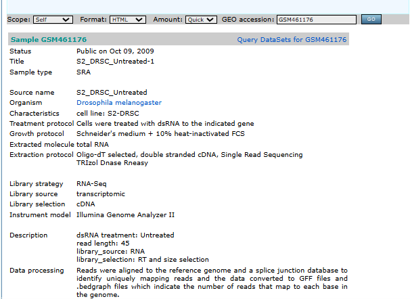
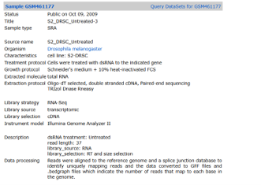
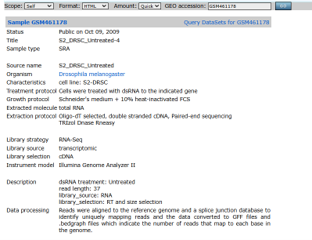
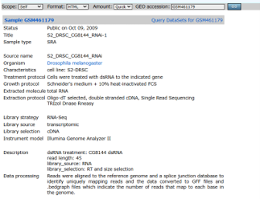

STAGE 1: DATASET CHARACTERIZATION
Procedure
1.	Navigate to NCBI GEO and locate each accession: GSM461176, GSM461177, GSM461178, GSM461179
2.	Identify the organism, the parent series (GSE) accession, and the experimental design
3.	Determine which samples belong to which experimental condition

Attach: GEO record screenshot for each accession
For GSM461176:

For GSM461177:

For GSM461178:

For GSM461179:

# Dataset Summary

| Field | Entry |
|-------|-------|
| Organism | *Drosophila melanogaster* |
| Parent Series (GSE) | GSE18508 *(common for all)* |
| Experimental Design | **Experiment type:** Expression profiling by high throughput sequencing  **Overall design:** Analysis of Poly(A)+ RNA from S2-DRSC cells depleted of mRNAs encoding RNA binding proteins |
| GSM461176 Condition | S2_DRSC_Untreated-1 |
| GSM461177 Condition | S2_DRSC_Untreated-3 |
| GSM461178 Condition | S2_DRSC_Untreated-4 |
| GSM461179 Condition | S2_DRSC_CG8144_RNAi-1 |
