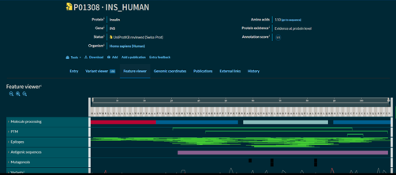
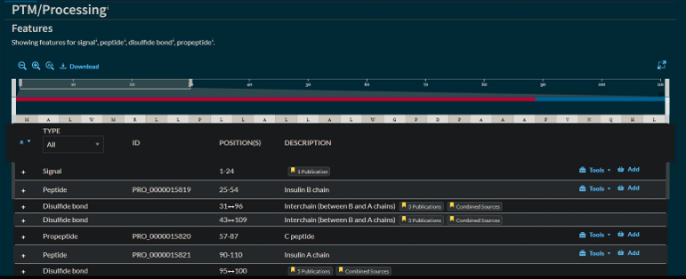

# Protein Databases: Structure & Function

## Hands-On Workbook

### Day 4 - Bioinformatics Internship 2026

## Learning Objectives

1. Access UniProt and explore protein records
1. Find and interpret protein domains and functional sites
1. Understand protein structure using PDB
1. Explore conserved domains via InterPro/Pfam
1. Connect protein structure to function and disease

---

# Exercise 1: UniProt Protein Records

**Objective:** Find the human insulin protein record and interpret its key annotations.

## Part A: Searching UniProt

1. Go to https://www.uniprot.org
1. Search for: 'insulin human'
1. Select the reviewed (Swiss-Prot) entry for human insulin (INS)

### Q1: What is the UniProt accession number (e.g. P01308) for human insulin?

____________________________________P01308___________________________________

### Q2: What is the protein's full name and entry name?

INS_HUMAN – entry name, Insulin – full name

---

## Part B: Sequence & Features

Open the 'Sequence' and 'Family & Domains' sections. Fill in the table below:

(viewed in PTM/processing tab)

  

  

| Feature | Value |
|---------|-------|
| Sequence length (aa) | 110 |
| Signal peptide (yes/no, residues) | Yes, 1-24 position |
| Chain name after processing | A chain, B chain |
| Number of disulfide bonds | 3 |

### Q3: Insulin is synthesized as a longer precursor (preproinsulin) and cleaved into smaller pieces. What are the names of these processed pieces, and why is processing necessary for function?

Preproinsulin consists of peptide chains A,B and C. The C chain gets removed to form the mature insulin and becomes propeptide. A and B peptide chains are what the protein gets cleaved into. This processing is required for insulin’s normal functioning. In case of Hyperproinsulinemia, a certain variant is caused by a mutation which impairs post-translational cleavage of insulin which contributes to the disorder. Hence processing of insulin is vital.
# Exercise 2: Protein Domains & Conserved Regions

**Objective:** Identify functional domains in the insulin protein family using InterPro/Pfam.

## Part A: Access InterPro

1. Go to https://www.ebi.ac.uk/interpro
1. Search for human insulin (or follow the cross-reference link from your UniProt entry)
1. Click on the 'Domains and Repeats' section

### Q1: What is the name of the main conserved domain/family identified for insulin (e.g. Insulin-like superfamily)?

____________________________________Insulin_________________________________________

---

## Part B: Compare Domain Architecture

Compare insulin's domain architecture to one related family member (e.g. IGF-1 or relaxin). Complete the table:

| Feature | Insulin | Related Protein |
|---------|----------|-----------------|
| Protein name | Insulin | Insulin-like growth factor, IGF2_human |
| Domain/family name | Insulin family | Insulin family |
| # of domains | #signal | #signal |
| Shared domain? (Yes/No) | Yes | Yes |

### Q2: Based on shared domains, what does this suggest about the evolutionary relationship between insulin and this related protein?

They share a 79 % identity which shows they share a common ancestor(more or less) due to having similar conserved domains.

# Exercise 3: Protein Structure (PDB)

**Objective:** Explore the 3D structure of insulin and relate structure to function.

## Part A: Access the Protein Data Bank

1. Go to https://www.rcsb.org
1. Search for: 'human insulin'
1. Select a structure determined by X-ray crystallography

### Q1: What is the PDB ID of your selected structure?

pdb_00006rlx

### Q2: What experimental method was used, and what is the resolution (in Å)?

X-RAY DIFFRACTION, 1.50 Å

---

## Part B: Structural Features

Use the 3D viewer to examine the structure. Fill in the table:

| Feature | Value |
|---------|-------|
| Number of protein chains | 2 : relaxin A chain (has A,C) and relaxin B chain(has B,D) |
| Secondary structure types present (helix/sheet) | Both (majority is helix) |
| Ligands/ions present (if any) | PCA |
| Oligomeric state (monomer/dimer/hexamer) | dimer |

### Q3: How does insulin's quaternary structure (e.g. hexamer with zinc) relate to how it is stored and released in the body?

Inside the high-zinc, acidic environment of beta pancreatic cell secretory granules, six insulin molecules cluster around two central zinc ions. This large, tightly packed hexamer structure protects the hormone from chemical degradation and prevents it from aggregating into toxic amyloid fibrils. When blood glucose rises, the hexamers are exocytosed into the bloodstream. Because the blood has a drastically lower zinc concentration and a neutral pH, the zinc instantly dissociates, causing the hexamer to break apart into dimers and then active monomers. These tiny monomers can diffuse easily through capillary walls to lower blood sugar.

# Exercise 4: Disease-Associated Variants

**Objective:** Connect protein structure/function to disease-causing mutations.

In your UniProt entry, check the 'Pathology & Biotech' or 'Disease & Variants' section.

### Q1: Name one disease-associated variant listed for insulin. Where in the protein structure does it occur, and what effect might it have on function?

---

# Exercise 5: Connecting Days 1-4

Write a paragraph (150-200 words) connecting your findings from Days 1-4. Include: (1) What BLAST told you about insulin evolution (Day 1), (2) Where the insulin gene lives (Day 2), (3) How and where insulin is expressed (Day 3), (4) What the insulin protein looks like and how its structure relates to its function (Day 4).

From Day 1 blast analysis it was clear that humans share ancestry with gorillas due to 100% query cover for the insulin gene. From Day 2 I collected data from multiple databases like ensembl, UCSC and clinvar, I could understand that the reason for gorilla showing similarity is due to the insulin gene being highly conserved compared to other organisms. UCSC gave a more pictorial representation for the same and it was possible to find the upstream and downstream genes along with their chromosome locations. From Day 3 RNA database of GEO(yet to figure out how to use). From Day 4 content, the 3D structure and annotations were clear and using the same site of PDB, protein sequences could be downloaded, variants in the sequence in the form of SNPs(single nucleotide polymorphisms) gives related disorders. Its function and chains were also understood.

---

# Reflection

### Why is it important to study a protein's 3D structure, and not just its amino acid sequence, in order to understand its function?

3D structure of a protein can help visualise its domains(number, region..) and can help identify the secondary structure it is present in (sheet/helix) unlike just studying the sequence of amino acids which forms the primary structure. Based on the number of chains(polypeptides), the oligomeric form can be ascertained as monomer/dimer and so on. Studying these helps connect it to the protein’s function as in case of insulin, which forms a hexamer with 2 zinc ions with 3 separate dimers as units won’t have biological function if not stored as a dimer inside the body(stable form).
